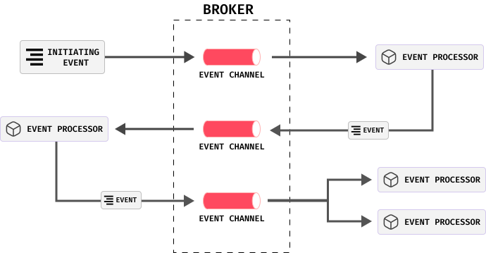
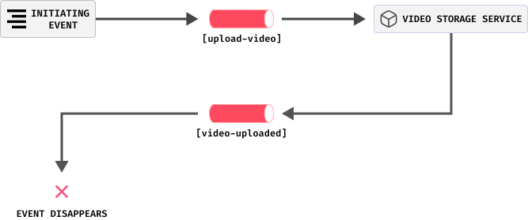
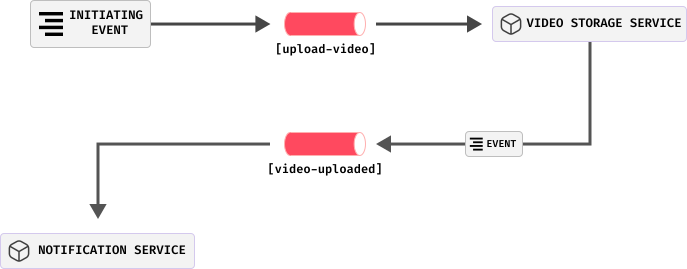
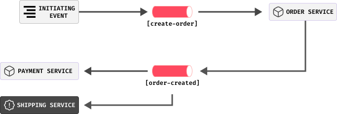

# Event Driven Architecture

The event-driven architecture is a style of architecture that is used to develop distributed asynchronous and highly scalable applications. This architecture consists of highly decoupled components that receive and send messages asynchronously.

Most applications use what is called request-based model, where the client sends a request to the specific endpoint of the server and waits for the response.

 In event-based model, applications takes actions when something happens in the system. One of the applications publishes an event, and other applications subscribe to that event. When the event is published, all the subscribers are notified and they can take actions based on the event. This is a very powerful model that allows us to build highly scalable and loosely coupled applications.

There are two main topologies of event-driven architectures:

  * **Broker Topology**
  * **Mediator Topology**

I will cover both of them in this article.

## Broker Topology

In this topology there is a component called *initiating event*. This is the event that starts the process. The initiating event is published to the broker, and the other component which is called *the event processor* gets the event from the broker and processes it. When the event is processed, the event processor can publish another event to the broker, and this can continue like a chain reaction.

In this topology, an event processor can publish an event even if there is no subscriber for that event. This practice provides a great flexibility in the system. When a new event processor is added to the system, it can subscribe to the events that it is published. For example, there is a system that stores videos.

 When a video is uploaded, the video storage service publishes an event to the broker. The order service does not know if there is a subscriber for that event. If there is no subscriber, the event disappears.

 The subscriber can be added later. For instance, in the future of the system there can be a subscriber that sends an notification to the user when a video is uploaded. The new notification service can be easily added to the system without changing the other event processors. This is a great advantage of this topology.

There are also some negative effects of this topology. First of all, you have no control over the flow of the events. No any event processor knows if the wanted business transaction is actually complete. What if one of the event processors fails? The event is lost and the business transaction is stuck. Since there is no any central manager that controls the flow of the events, the event processors cannot know if the business transaction is complete or not and cannot take any action. Initiating Event can be published to the broker multiple times manually but the other succeeded event processors can make duplicate changes to the system. 

For example,
if `create-order` event is published and the order service processes it. Then it publishes the `order-created` event; the payment and shipping services get that event and charge the customer and ship the order, but assume that shipping service is down or failed to process the event. In this  situation, the customer will be charged but the order will not be shipped. If `create-order` event is published again, the payment service will charge the customer again, but the shipping service will not ship the order again. The event processors can be designed in a idempotent way to solve that problem, but the system need a way to re-publish initiating event. No any event processor knows about the wanted business transaction, therefore no one is responsible for restarting the business transaction flow, but if the system knows the flow of the events there will be a central manager that can re-publish the initiating event. If a central manager added to the system, the system topology will be called as **Mediator Topology**.
To solve these negative effects of the broker topology,  **Mediator Topology** can be used, but that topology change creates new trade-offs.
