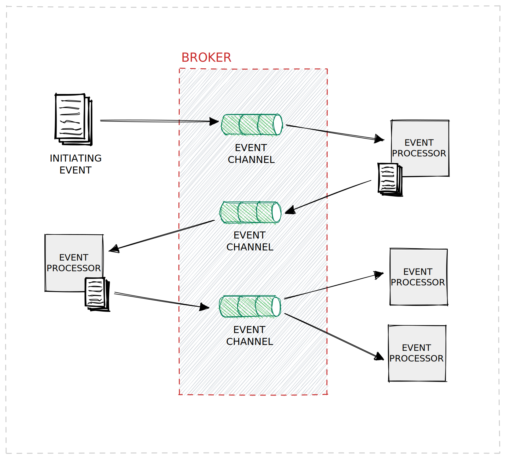
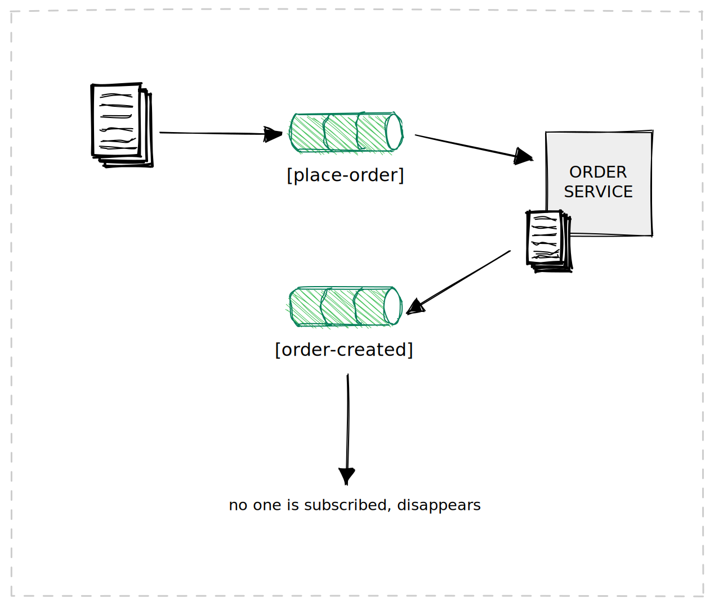
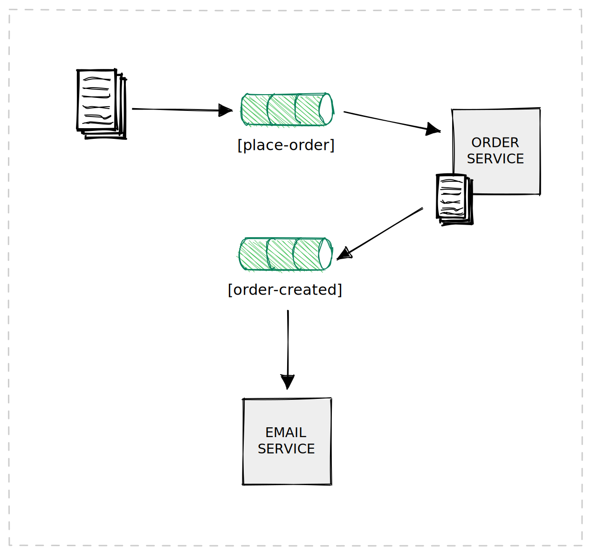

# Event Driven Architecture

The event-driven architecture is a style of architecture that is used to develop distributed asynchronous and highly scalable applications. This architecture consists of highly decoupled components that receive and send messages asynchronously.

Most applications use what is called request-based model, where the client sends a request to the specific endpoint of the server and waits for the response.

 In event-based model, applications takes actions when something happens in the system. One of the applications publishes an event, and other applications subscribe to that event. When the event is published, all the subscribers are notified and they can take actions based on the event. This is a very powerful model that allows us to build highly scalable and loosely coupled applications.

There are two main topologies of event-driven architectures:

  * **Broker Topology**
  * **Mediator Topology**

I will cover both of them in this article.

## Broker Topology

In this topology there is a component called *initiating event*. This is the event that starts the process. The initiating event is published to the broker, and the other component which is called *the event processor* gets the event from the broker and processes it. When the event is processed, the event processor can publish another event to the broker, and this can continue in chain-like fashion.

In this topology, an event processor can publish an event even if there is no subscriber for that event. This practice provides a great flexibility in the system. When a new event processor is added to the system, it can subscribe to the events that it is published. For example, there is a system that processes orders.

 When an order is placed, the order service creates and order and publishes an event to the broker. The order service does not know if there is a subscriber for that event. If there is no subscriber, event disappears.

 The subscriber can be added later, and it will receive the event. For instance, in the future of the system, there can be a subscriber that sends an email to the customer when an order is placed. The new email service can be easily added to the system without changing the other event processors. This is a great advantage of this topology.

